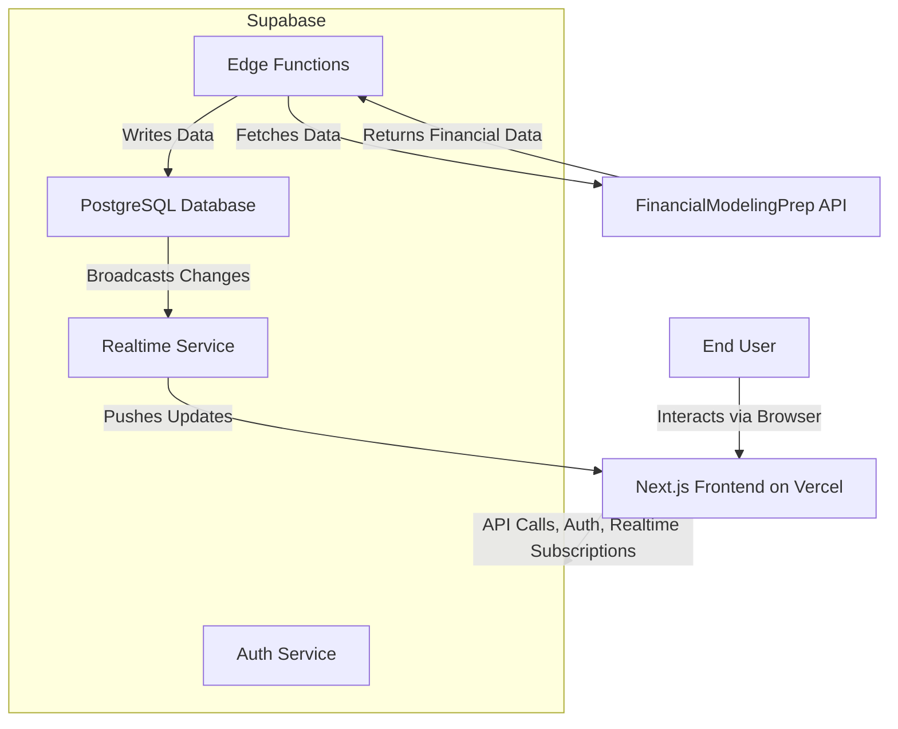
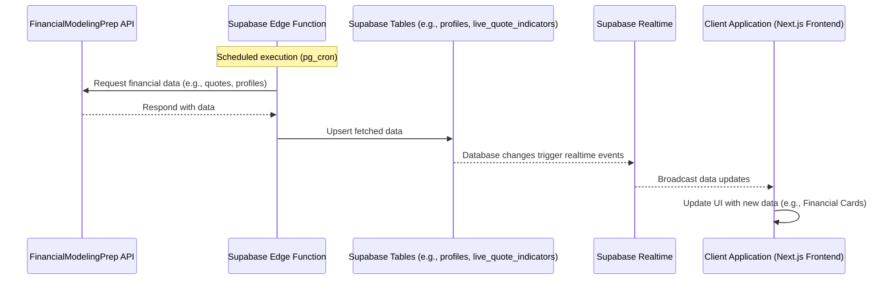
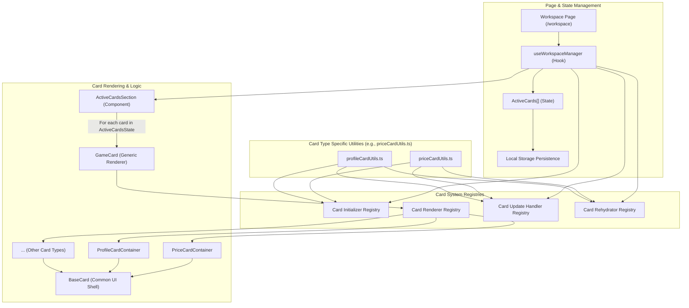
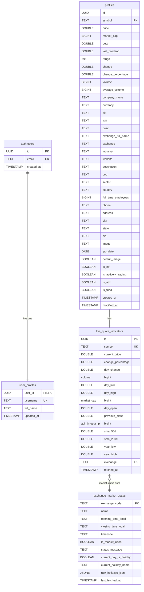

# Executive Summary: Tickered

## 1. Introduction & Core Concept

Tickered is a forthcoming web application designed to revolutionize financial education and investment analysis. It transforms complex financial data into an interactive, digestible, and engaging experience through a unique "Card-based" system. Users can explore stocks, cryptocurrencies, and other financial instruments by interacting with over 100 distinct types of dynamic "Financial Cards" (e.g., Company Profile, Price, Earnings, Volume, Dividends, Sentiment, News), each powered by live data.

## 2. Problem Addressed

Traditional financial information platforms often overwhelm users, especially beginners, with vast amounts of non-contextualized data. This creates a steep learning curve and can make investment analysis feel boring, inaccessible, and isolating. There's a lack of intuitive tools that blend deep data exploration with community insights and personalized learning paths.

## 3. Our Solution – Interactive & Social Financial Cards

Tickered addresses these challenges by offering:

- **Modular Card System:** Users build personalized dashboards by adding various Financial Cards to a dynamic workspace. Each card displays self-contained, live-updated information.
- **Deep Interactivity:** Metrics within cards (e.g., current price, 52-week high/low, SMA 50) are clickable, instantly generating new, related cards in the workspace, allowing for intuitive drill-down and discovery.
- **Sleek, User-Centric Design:** The interface is designed to be minimalist, visualization-rich, and gamified, leveraging modern UI components for an engaging financial exploration experience.

## 4. Target Audience

Tickered caters to two primary user groups:

- **Beginner Investors:** Individuals seeking to learn about investing and understand market data without being overwhelmed. They benefit from the simplified card format and community insights.
- **Professionals & Experienced Investors:** Users who require powerful tools for in-depth financial metric exploration, company comparisons, and the creation of sophisticated, shareable dashboards and "Collections."

## 5. Unique Selling Proposition (USP)

- **Novel Exploration Method:** An intuitive and engaging way to navigate complex financial data through interactive, self-contained cards.
- **Personalized & Dynamic Dashboards:** Users tailor their workspace to their specific interests with live data updates.
- **Dual Audience Appeal:** Simplifies complexity for beginners while offering depth and customization for professionals.

## 6. Business Model

Tickered will operate on a freemium model with revenue generated through:

- **Premium Subscriptions:** Features like multiple workspaces, public dashboard publishing, custom entry cards, and potentially advanced analytics.

## 7. Technical Architecture & Development Status

The application is currently in the development phase, being built with a modern, robust technology stack. This section provides a deeper overview of its components and interactions.

### 7.1 Core Technologies

- **Frontend & UI:**
  - **Framework:** Next.js 15 (App Router, React Server Components & Client Components) for a responsive and interactive user interface.
  - **Styling:** Tailwind CSS for utility-first styling.
  - **Component Library:** Shadcn UI, providing reusable and customizable components.
  - **Language:** TypeScript for type safety across the frontend.
- **Hosting:** The Next.js application is hosted on **Vercel**.
- **Backend & Core Data Management:** **Supabase** serves as the comprehensive backend solution, providing:
  - PostgreSQL Database
  - User Authentication (via `auth.users` and a linked `public.user_profiles` table)
  - Serverless Edge Functions (Deno runtime)
  - Realtime capabilities
- **External Data Source:** Primary financial data is sourced from the **FinancialModelingPrep (FMP) API**.
- **Testing:** A testing strategy incorporating Jest with JSDOM is implemented.

### 7.2 Visual Architecture Overview

#### High-Level System Architecture

### 7.3 Detailed Frontend Architecture

The frontend, built with Next.js and the App Router, emphasizes a modular and component-driven structure.

- **Directory Structure:** Key directories include `src/app` for routing and page components, `src/components` for UI and game logic, `src/hooks` for reusable stateful logic (e.g., `useWorkspaceManager`, `useStockData`), `src/contexts` for global state (e.g., `AuthContext`), and `src/lib` for utilities and Supabase client setup.
- **Modular Card System:**
  - The core of the application revolves around "Financial Cards" located primarily under `src/components/game/cards/`.
  - `GameCard.tsx` acts as a generic renderer.
  - `BaseCard.tsx` provides the common UI shell (flippable card, header, social interactions).
  - Specific card types (e.g., `PriceCard`, `ProfileCard`) extend this system with their own content renderers, data types, and interaction logic.
  - A set of registries and initializers (`cardInitializer.types.ts`, `cardRenderers.ts`, `cardRehydration.ts`, `cardUpdateHandler.types.ts`) manage the lifecycle and behavior of these cards, allowing for an extensible plugin-like architecture.
- **State Management:**
  - Client-side state is managed using a combination of React hooks (`useState`, `useCallback`), custom hooks like `useWorkspaceManager` for the main interactive card area, and `AuthContext` for global authentication state.
  - `useLocalStorage` hook is employed for persisting workspace card configurations.

#### Frontend Card System Overview

### 7.4 Detailed Supabase Backend

- **Data Ingestion & Processing:**
  - Supabase Edge Functions (e.g., `fetch-fmp-quote-indicators`, `fetch-all-exchange-market-status`) are scheduled via `pg_cron` to fetch data from the FMP API.
  - This data populates core tables like `public.profiles` (company information) and `public.live_quote_indicators` (live market data).
- **Real-time Data Propagation:** Changes to key tables (e.g., `live_quote_indicators`, `profiles`) are broadcast using Supabase Realtime. The frontend subscribes to these broadcasts (via `realtime-service.ts`) to update Financial Cards dynamically.
- **Core Application Database Schema:**
  - `public.user_profiles`: Extends `auth.users` with custom profile data, auto-populated on new user creation.
  - `public.profiles`: Stores detailed static company information.
  - `public.live_quote_indicators`: Stores frequently updated market data for symbols.
  - `public.exchange_market_status`: Stores market status for different exchanges.
  - Database tables include triggers for actions like updating `modified_at` timestamps (via `moddatetime` extension).

#### Supabase Core Database Schema (Simplified ERD)

## 8. Purpose of this Document

This summary serves to clearly articulate the vision, functionality, target audience, and technical architecture of Tickered. It is intended to provide a comprehensive understanding for collaborative development and for training AI assistants on the project's background.
